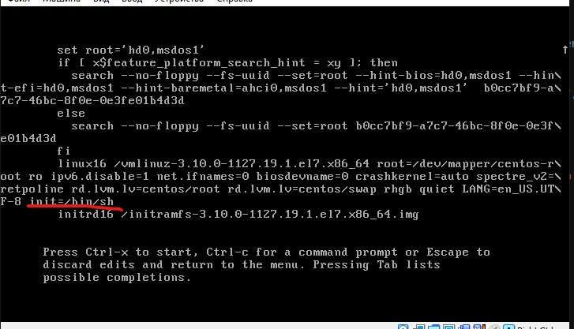
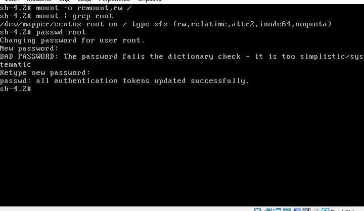
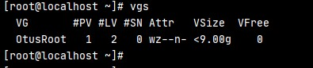
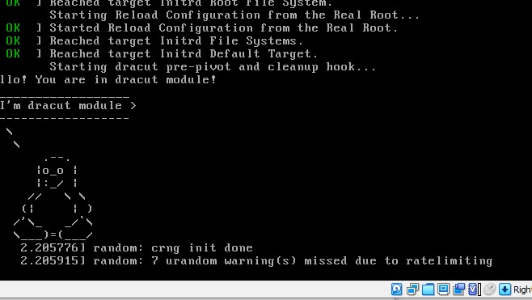

# Домашка по загрузчику linux

## 1. Загрузка в систему без пароля

### Способ 1

* Заходим в настройки ядра при загрузке и добавляем 
`init=/bin/sh`

* Перемонтируем в систему в rw
`mount -o remount,rw /`

* Поменяем пароль для root
`passwd root`

* Перезагружаем через `/sbin/reboot -f`

* Заходим в систему под root и изменнеым паролем

### Способ 2

* Заходим в настройки загрузки ядра и добавляем параметр: 
`rd.break`

* Загружаемся в систему и перементируем /sysroot в rw:
`mount -o remount,rw /sysroot`

* Переходим под root: 
`chroot /sysroot`

* Выставляем пароль:
`passwd root`

* Указываем selinux root каталог:
`touch /.autorelabel`

* Перезагружаемся в систему

### Способ 3

* Заходим в настройки загрузки ядра и добавляем параметр: 
`rw init=/sysroot/bin/sh`

* Остальное как в предыдущем примере, только система уже смонтирована в rw

## 2. Переименовать VirtualGroup

* Меняем название нашей группы на новое
`vgrename centos OtusRoot`

* Правим /etc/fstab, /etc/default/grub, /boot/grub2/grub.cfg. Не забываем про остальные разделы помимо root

* Пересоздаем initrd image:
`mkinitrd -f -v /boot/initramfs-$(uname -r).img $(uname -r)`

* Выхлоп:
[script.out](./script.out)

* Перезагружаем систему, смотрим что название VG изменилось:

## 3. Добавляем модуль в initrd

* Создаем папку для модуля: `mkdir /usr/lib/dracut/modules.d/01test`

* Добавляем скриты [setup-module.sh](./scripts/module-setup.sh), [test.sh](./scripts/test.sh)

* Пересобираем образ: `dracut -f -v`

* Выхлоп:
[initrdmodule.out](./initrdmodule.out)

* Проверяем что модуль загрузился
